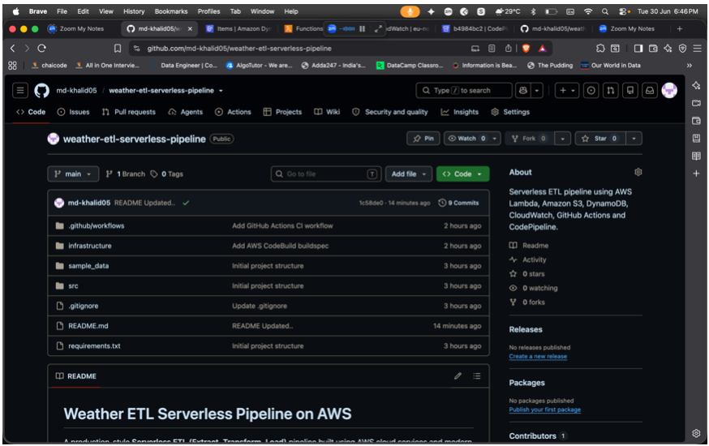
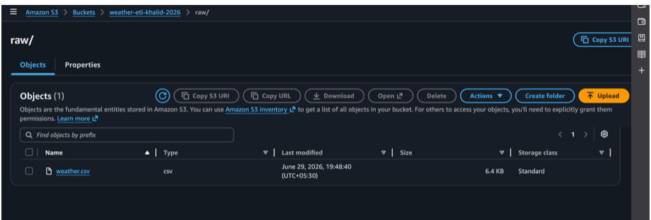
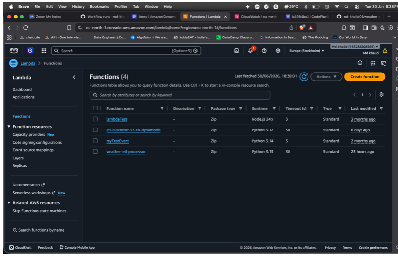
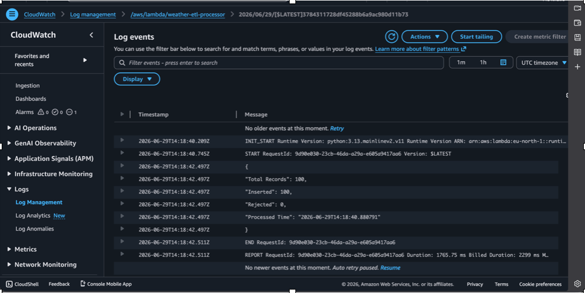
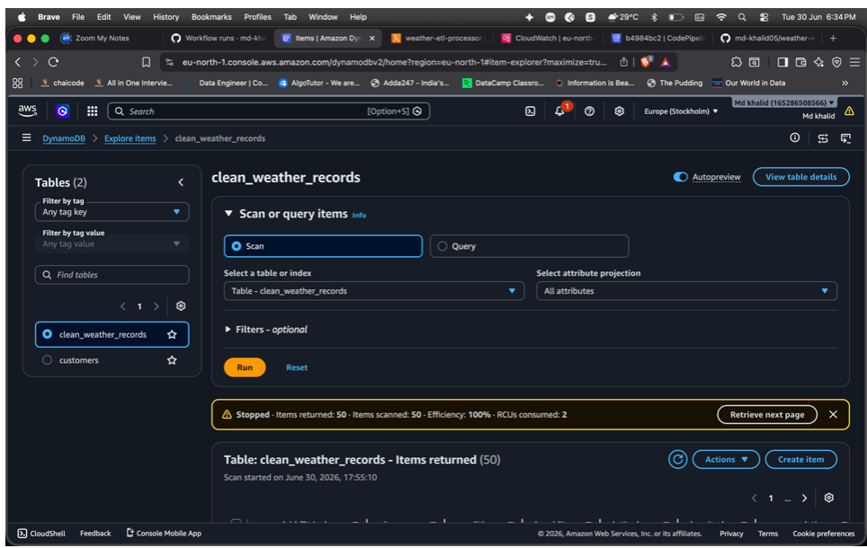
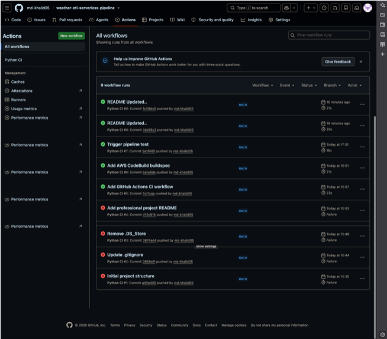
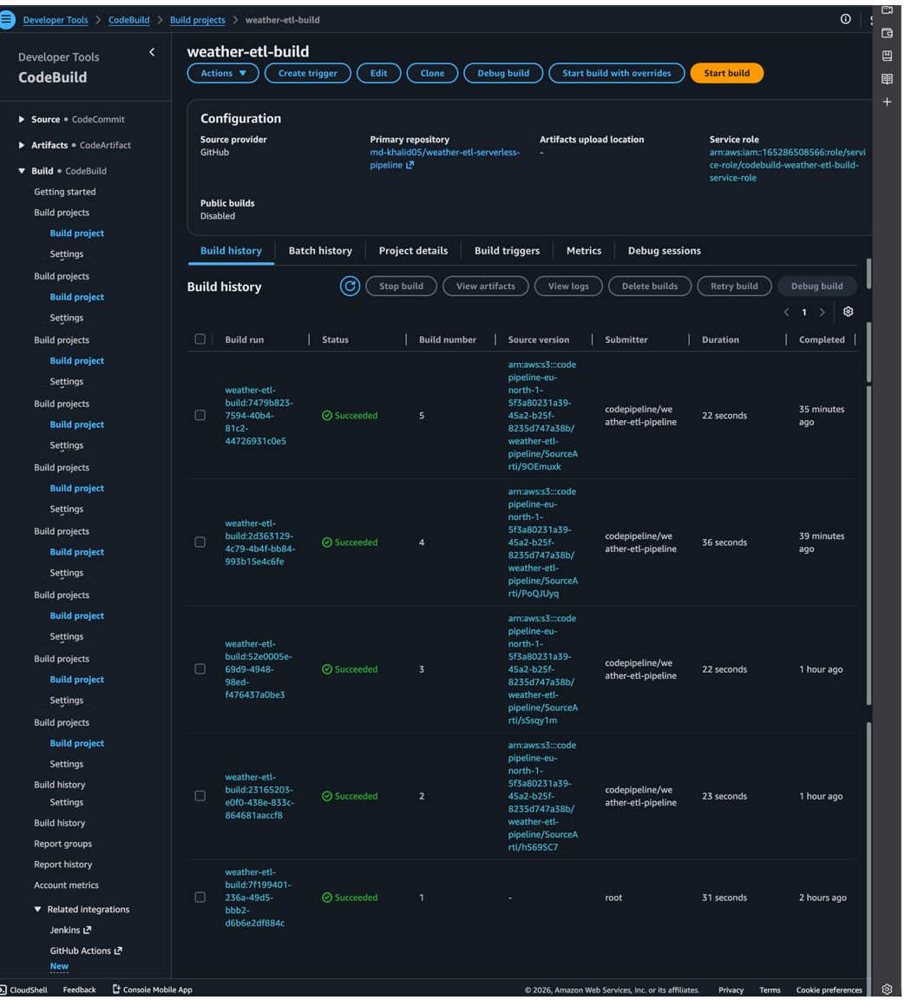
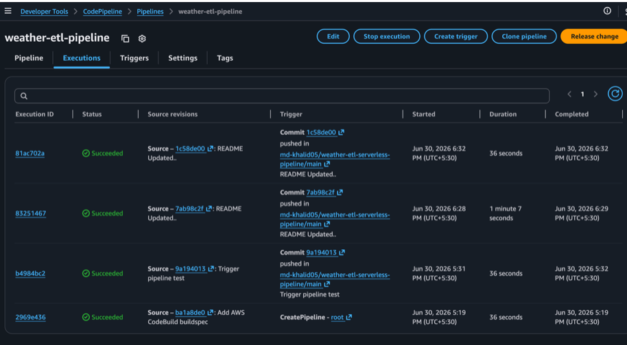
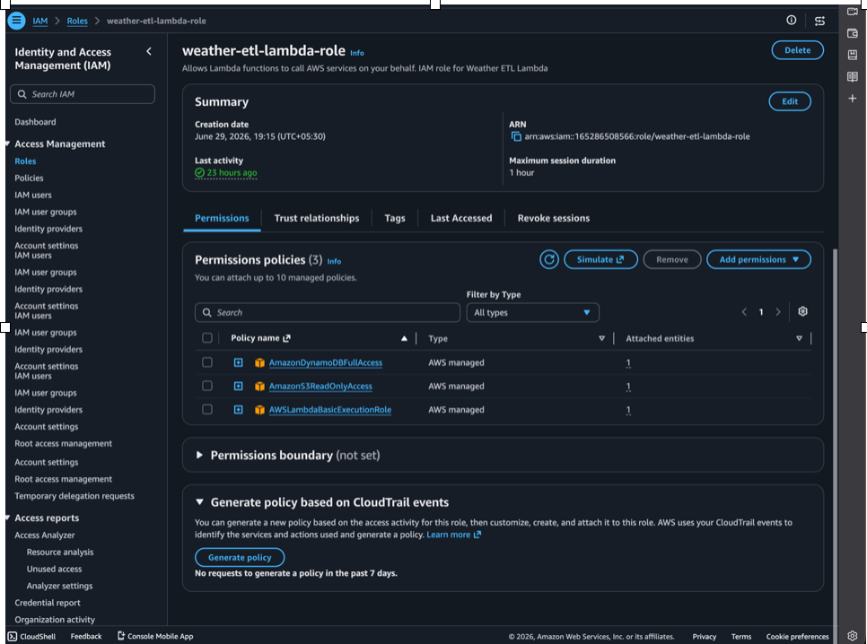

# 🌦️ Weather ETL Serverless Pipeline on AWS

A production-inspired **serverless ETL pipeline** that extracts weather data from a CSV dataset stored in Amazon S3, transforms and validates the records using AWS Lambda, loads the cleaned data into Amazon DynamoDB, and automates validation and deployment through GitHub Actions and AWS CodePipeline.

---


## 📖 Project Overview

This project demonstrates the implementation of a serverless ETL (Extract, Transform, Load) pipeline on AWS using modern cloud-native services.

The pipeline automatically processes weather datasets uploaded to Amazon S3. Whenever a CSV file is uploaded, an AWS Lambda function is triggered to validate, clean, and transform the dataset before loading the processed records into Amazon DynamoDB. Throughout execution, Amazon CloudWatch captures logs for monitoring and troubleshooting.

To improve software quality and deployment reliability, the entire project is integrated with GitHub Actions for continuous integration (CI) and AWS CodePipeline with AWS CodeBuild for continuous deployment (CD).

The objective is to simulate a real-world data engineering workflow using fully managed AWS services while following serverless architecture principles.

## 🎯 Business Scenario

Imagine a weather monitoring organization that receives daily weather observations collected from multiple cities.

Instead of manually cleaning and storing the data, the organization requires an automated cloud-based ETL pipeline capable of:

- Receiving raw weather datasets
- Validating incoming records
- Cleaning inconsistent or invalid data
- Standardizing weather attributes
- Loading processed records into a NoSQL database
- Maintaining execution logs for auditing
- Automatically validating and deploying application updates

This project implements that workflow using AWS serverless services.

## 🏗️ Architecture Overview

```text
                Weather Dataset (CSV)
                        │
                        ▼
            Amazon S3 (raw folder)
                        │
             S3 Object Created Event
                        │
                        ▼
              AWS Lambda ETL Function
        ┌───────────────────────────────┐
        │ Read CSV                      │
        │ Validate Records              │
        │ Remove Invalid Entries        │
        │ Standardize Data              │
        │ Generate record_id            │
        │ Add processed_timestamp       │
        └───────────────────────────────┘
                        │
                        ▼
       Amazon DynamoDB (clean_weather_records)
                        │
                        ▼
         Amazon CloudWatch Logs & Monitoring


──────────────────────────────────────────────

GitHub Repository
        │
GitHub Actions (CI)
        │
AWS CodeBuild
        │
AWS CodePipeline (CD)
        │
Automatic Deployment
```

## 🔄 ETL Workflow

| Stage         | Description                                                                                    |
| ------------- | ---------------------------------------------------------------------------------------------- |
| **Extract**   | Read raw weather CSV from Amazon S3                                                            |
| **Transform** | Validate records, remove invalid rows, standardize fields, generate unique IDs, add timestamps |
| **Load**      | Store cleaned records into Amazon DynamoDB                                                     |
| **Audit**     | Log processing statistics in Amazon CloudWatch                                                 |

## 💻 Technology Stack

| Category             | Technology                |
| -------------------- | ------------------------- |
| Programming Language | Python 3.11               |
| Cloud Platform       | Amazon Web Services (AWS) |
| Storage              | Amazon S3                 |
| Compute              | AWS Lambda                |
| Database             | Amazon DynamoDB           |
| Monitoring           | Amazon CloudWatch         |
| Version Control      | Git & GitHub              |
| CI                   | GitHub Actions            |
| CD                   | AWS CodePipeline          |
| Build Service        | AWS CodeBuild             |

## ☁️ AWS Services Used

| Service           | Purpose                        |
| ----------------- | ------------------------------ |
| Amazon S3         | Stores raw weather datasets    |
| AWS Lambda        | Executes ETL logic             |
| Amazon DynamoDB   | Stores cleaned weather records |
| Amazon CloudWatch | Execution logs and monitoring  |
| AWS IAM           | Secure permission management   |
| GitHub            | Source code management         |
| GitHub Actions    | Continuous Integration         |
| AWS CodeBuild     | Build validation               |
| AWS CodePipeline  | Continuous Deployment          |

## 📂 Repository Structure

```text
weather-etl-serverless-pipeline/
│
├── .github/
│   └── workflows/
│       └── ci.yml                 # GitHub Actions workflow
│
├── infrastructure/
│   ├── buildspec.yml              # AWS CodeBuild configuration
│   └── iam_policy.json            # IAM permissions (optional)
│
├── sample_data/
│   └── weather.csv                # Sample weather dataset
│
├── screenshots/
│   ├── github/
│   ├── s3/
│   ├── lambda/
│   ├── dynamodb/
│   ├── cloudwatch/
│   ├── codebuild/
│   ├── codepipeline/
│   └── iam/
│
├── src/
│   └── lambda_function.py         # Main ETL logic
│
├── README.md
├── requirements.txt
└── .gitignore
```

## 📊 Dataset Information

The pipeline processes a sample weather dataset stored as a CSV file in Amazon S3.

### Dataset Fields

| Field     | Description              |
| --------- | ------------------------ |
| record_id | Unique weather record ID |
| city      | City name                |
| condition | Weather condition        |
| humidity  | Relative humidity (%)    |
| latitude  | Geographic latitude      |
| longitude | Geographic longitude     |

The dataset simulates weather observations collected from multiple cities and is used to demonstrate a complete serverless ETL workflow.

## ⭐ Project Features

- Serverless ETL Architecture
- Event-driven processing using Amazon S3 triggers
- Automatic CSV validation
- Data cleaning and standardization
- Unique record generation
- DynamoDB NoSQL storage
- CloudWatch execution logging
- GitHub-based version control
- Automated CI using GitHub Actions
- Automated deployment using AWS CodePipeline
- Least-Privilege IAM implementation

## 🔄 ETL Pipeline

### 1️⃣ Extract

The Lambda function is automatically invoked whenever a CSV file is uploaded to the **raw/** folder in Amazon S3.

During extraction:

- Reads the uploaded CSV
- Parses weather records
- Validates file accessibility
- Loads records into memory

---

### 2️⃣ Transform

Each record undergoes several transformation steps:

- Remove incomplete records
- Standardize city names
- Convert humidity values to integers
- Generate a unique `record_id`
- Add a `processed_timestamp`
- Validate latitude and longitude values

---

### 3️⃣ Load

Validated records are inserted into Amazon DynamoDB.

Partition Key

Each item is stored as an independent weather observation.

---

### 4️⃣ Audit

Execution statistics are recorded in Amazon CloudWatch including:

- Records processed
- Successful inserts
- Failed records
- Processing duration
- Lambda execution status

## 🚀 CI/CD Workflow

```text
Developer
    │
    ▼
Push Code to GitHub
    │
    ▼
GitHub Actions
    │
    ├── Install Dependencies
    ├── Validate Python Syntax
    └── Run Build Checks
    │
    ▼
AWS CodePipeline
    │
    ▼
AWS CodeBuild
    │
    ▼
Deployment Ready
```

### Continuous Integration

GitHub Actions automatically:

- Checks out repository
- Installs dependencies
- Compiles Lambda function
- Detects syntax errors

### Continuous Deployment

AWS CodePipeline:

- Detects GitHub commits
- Starts CodeBuild
- Validates build
- Produces deployment artifacts

# 📸 Project Demonstration

### GitHub Repository

The complete source code is maintained in GitHub with a structured project layout.



### Amazon S3 Bucket

Raw weather datasets are uploaded to the **raw/** directory inside Amazon S3.



### AWS Lambda

The Lambda function performs the complete ETL process.

It is triggered automatically whenever a new dataset is uploaded.



### Amazon CloudWatch

CloudWatch captures Lambda execution logs, errors, and processing statistics.



### Amazon DynamoDB

Clean weather records are stored in DynamoDB after successful validation.



### GitHub Actions

Every push automatically validates the Lambda source code.



### AWS CodeBuild

Builds are executed whenever CodePipeline is triggered.



### AWS CodePipeline

AWS CodePipeline automates continuous deployment from GitHub.



### IAM Roles

Least-privilege IAM permissions are assigned to Lambda for secure access to AWS services.


